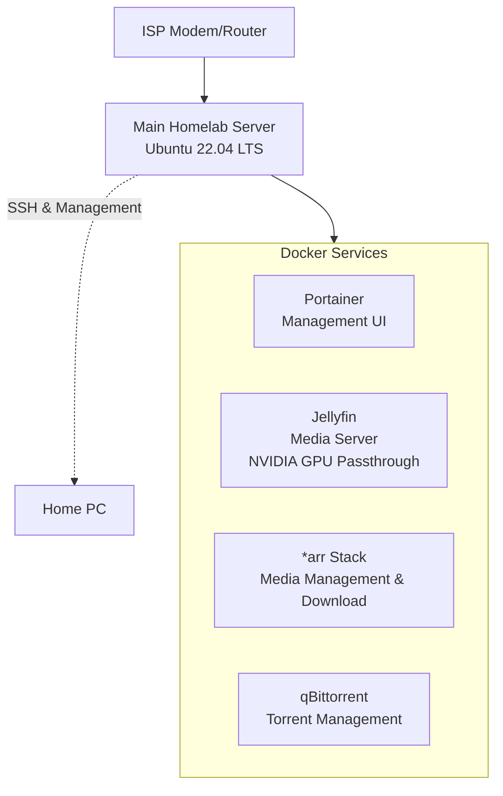

# 🖥️ Chrono's Homelab

> *"A powerful learning environment built on repurposed hardware."*

This is my personal homelab, built on a decommissioned gaming PC. It serves as my primary platform for experimenting with DevOps tools, containerization, networking, and self-hosted services.

## 🔧 Hardware Specifications

| Component            | Specification                               |
|----------------------|---------------------------------------------|
| **CPU**              | AMD FX-6300 (6 Cores @ 3.5GHz)              | 
| **RAM**              | 20 GB DDR3                                  | 
| **GPU**              | NVIDIA GTX 970 4GB                          | 
| **Primary Storage**  | 12 TB Seagate IronWolf HDD                  | 
| **Boot Drive**       | 256GB Western Digital SSD                   |
| **PSU**              | Antec Atom 450W                             | 
| **Case**             | Antec GX300                                 | 
| **OS**               | Ubuntu Server 22.04 LTS (Headless)          | 

## 🌐 Network Overview



*   **Hostname:** `thevoid`
*   **Local IP:** `192.168.3.133`
*   **Access:** Primarily via SSH. Web services accessed locally.

## 🐳 Deployed Services

Here are the core services currently running on the lab via Docker Compose:

| Service | Description | Status | Web Interface |
| :--- | :--- | :---: | :--- |
| **Jellyfin** | Media server with NVIDIA hardware transcoding. | ✅ Live | `http://192.168.3.133:8096` |
| **CraftyController** | Minecraft Server Manager | ✅ Live | `httsp://192.168.3.133:8443` |
| **qBittorrent** | Torrent client with VPN integration. | ✅ Live | `http://192.168.3.133:8081` |

## 📁 Repository Structure

```
homelab-docs/
├── 📄 README.md                 # You are here
```

## 🚧 Current Projects & Goals

-   [ ] **Media Server Performance** Enable Hardware Accel. and use GPU to Transcode for Jellyfin
-   [ ] **Secure VPN Access** Configure wireguard to access network remotely
-   [ ] **Reverse Proxy/Security** Some services require https, meaning we need to setup certificates or reverse proxy

## 📝 Notes & Log

-   **2025-08-19:** Initialized this documentation.

---
*“Never underestimate the raw power of a repurposed gaming PC.”*
